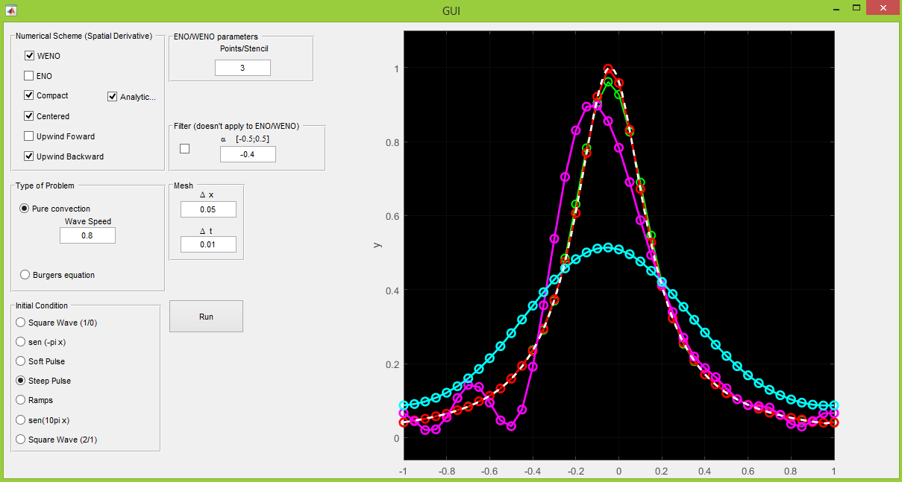

# GUI for Wave and Burgers Equations
This code is intended for educational purposes. It generates a GUI in MATLAB, which the user chooses to solve convection or burger's equations with schemes like centered compact finite differences, WENO and others. The time marching is accomplished with Runge-Kutta schemes. This was the first code I've wrote, so expect a lot of inelegance. Despite that, if your intentions are to observe the behavior of classical numerical schemes, you may find this code very useful. Just run the GUI.m file and you're good to go.

